- [Git In-depth Exercises](#git-in-depth-exercises)
  - [Git Best Practice](#git-best-practice)
  - [Workshop 地址](#workshop-地址)
  - [Git config](#git-config)
  - [Exercise-1 Commit Tree Blob](#exercise-1-commit-tree-blob)
  - [Exercise-2 Staging and Stashing](#exercise-2-staging-and-stashing)
    - [Staging](#staging)
    - [Stash](#stash)
  - [Exercise-3 References](#exercise-3-references)
    - [Reference](#reference)
    - [Detached HEAD](#detached-head)
  - [Exercise-4 Merging and ReReRe](#exercise-4-merging-and-rerere)
    - [Fast-Forward](#fast-forward)
    - [git merge --no-ff](#git-merge---no-ff)
    - [rerere 处理 merge conflict](#rerere-处理-merge-conflict)
  - [Exercise-5 History and Diffs](#exercise-5-history-and-diffs)
    - [git log](#git-log)
    - [^ 和 ~](#-和-)
    - [git show](#git-show)
    - [git diff](#git-diff)
    - [git branch --merge](#git-branch---merge)
  - [Exercise-6 Fixing Mistakes](#exercise-6-fixing-mistakes)
    - [git checkout](#git-checkout)
    - [git clean](#git-clean)
    - [git reset](#git-reset)
    - [git revert](#git-revert)
  - [Exercise-6 Rebase and Amend](#exercise-6-rebase-and-amend)
    - [git commit --amend](#git-commit---amend)
    - [git rebase](#git-rebase)
    - [rebase tips](#rebase-tips)
  - [Exercise-8 Forks And Remote Repos](#exercise-8-forks-and-remote-repos)
    - [fork & upstream](#fork--upstream)
    - [git pull --rebase](#git-pull---rebase)
    - [tracking branches](#tracking-branches)
    - [pull & fetch & push & tags](#pull--fetch--push--tags)
    - [PULL REQUESTS](#pull-requests)
    - [操作 remote 仓库的一些建议](#操作-remote-仓库的一些建议)
  - [Exercise-9 Advanced Tools](#exercise-9-advanced-tools)
    - [git grep](#git-grep)
    - [git cherry-pick](#git-cherry-pick)
    - [git blame](#git-blame)
    - [git bisect](#git-bisect)
    - [Git hooks](#git-hooks)
    - [Git template](#git-template)
  - [Github 技巧，详见 slide](#github-技巧详见-slide)

# Git In-depth Exercises

## Git Best Practice

> commit often, perfect later, publish once

## Workshop 地址

https://github.com/nnja/advanced-git

## Git config

```bash
# always rebase a branch instead of merging
git config --global pull.rebase true
git config branch.<branch_name>.rebase true
# user and email
git config --global user.name ""
git config --global user.email ""
# vscode
git config --global core.editor code --wait
# enable reuse recorded resolution
git config --global rerere.enabled true
# autocorrect in 1 second
git config --global help.autocorrect 10
# commit message tempalte
git config --global commit.template ~/.gitmessage.template
# alias
git config --global alias.st status
git config --global alias.co checkout
git config --global alias.br branch
git config --global alias.cm commit
git config --global alias.unstage "reset HEAD --"
git config --global alias.last "log -1 HEAD"
git config --global alias.lg "log --graph --pretty=format:'%C(auto)%h -%d %s %Cgreen(%cr) %C(bold blue)<%an>%Creset'"
```

```text
Subject line (try to keep under 50 characters)

Multi-line description of commit,
feel free to be detailed.

[Ticket: X]
```

[less 命令 cheat sheet](https://gist.github.com/nnja/5960fcfed3024a8bfdb272ee468e5c8e)

## Exercise-1 Commit Tree Blob

1. 初始化一个最简单仓库，新建一个 hello.txt
2. 用`git cat-file -t/-p`命令，观察 commit、tree、blob 之间的关系，通过 SHA1 生成的 id 来关联
3. 用`cat`命令观察 ` .git/HEAD` 指向了`.git/refs/heads/master` ，而 master 中是 commit id

## Exercise-2 Staging and Stashing

### Staging

1. 理解 Working Area、Staging Area、Repository 的区别
2. `git ls-files -s`命令查看 Staging Area 的文件，不会展示 working area 的变化
3. 习惯使用`git add -p`命令，可以用来跳过一些不想 add 到 staging area 的改动
4. add 到 staging area 之后想要反悔，用`git reset file`撤回到 working area，但保留了文件的改动，想要撤销改动再用`git checkout file`命令

### Stash

> stash 的典型场景是，dev 分支正在开发新功能，master 出现了需要紧急修复的 bug，此时无法切换到 master 分支，因为文件有冲突，要么 commit，要么 stash，要么 reset 或者 checkout 文件的变化。
> 最佳实践是，`git stash save "message" --include-untracked`未完成的工作，然后切换到 master 分支，新建一个 bugfix 分支，修复 bug 并 merge 到 master 分支后删除 bugfix 分支，然后切换到 dev 分支`stash pop`

1. stash 对于 working area 和 staging area 的变化都有效，但是想要 stash 新增的 untracked 的文件，需要使用`git stash --include-untracked`
2. `git stash save "WIP: making progress on xxx"` 描述未完成的工作
3. `git stash branch <optional branch name>` 创建一个新的分支
4. `git checkout <stash name> -- <file-name>` 从 stash 中恢复单个文件，而不是 apply 整个 stash
5. 清空 stash 可以用 pop、drop、clear（清空所有）

## Exercise-3 References

### Reference

> tag、branch、HEAD 都是 reference，都指向 commit，HEAD 默认指向 branch，branch 会随着 commit 操作自动更新到最新的 commit 上，而 tag 不会移动，是 snapshot。annotated tag 比普通 tag 更加常用。

1. `git show-ref` 命令查看所有的 references，`--heads | grep heads-name`，`--tags | grep tag-name`
2. `git tag <tag-name>` 不带参数的命令打上 lightweight tag，指向了某次 commit
3. `git tag -a <tag-name> -m <message>` 带参数的命令打上 annotated tag，指向了某次 commit 但储存了格外的信息因此 SHA1 值会变
4. `git tag --points-at <commit-id>` 来查看某个 commit 上所有的 tag
5. `git show <tag-name>` 查看某个 tag 的信息，千万不要打成`git tag show`，这样是打一个叫 show 的 tag
6. `git tag -d <tag-name>` 来删除 tag

### Detached HEAD

> 永远不要手动 git checkout 到某个 commit-id ，HEAD 会直接指向这个 commit ，形成 detached HEAD。如果在此基础上进行了一次 commit，就创建了 dangling commit，HEAD 移到到最新的 commit，但是没有任何 branch 或者 tag 指向这个 commit。如果不为这个 dangling commit 手动创建新的分支，就会被垃圾回收。

1. `git log --oneline` 命令可以看到这个 dangling commit，以及 HEAD 指向了它
2. `git checkout <branch-name>` 会提示当前的 commit 没有任何 branch 指向它
3. `git branch <new-branch-name> <commit-id>` 来 connect 这个 dangling commit

## Exercise-4 Merging and ReReRe

### Fast-Forward

> 创建 feature 分支后，如果 master 分支没有进行任何 commit，此时将 feature 分支 merge 到 master 分支上，相当于直接把 master 分支指向了 feature 分支指向的 commit。缺点是会形成线性的 commit，无法追踪 feature 分支，不利于定位 bug。

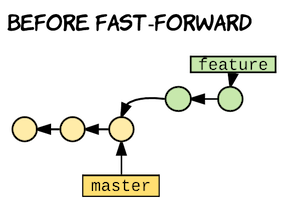

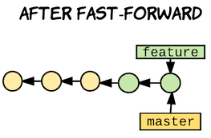

### git merge --no-ff

> 保留 merge 历史，即便 master 没有任何 commit，merge 的时候强行创建一次 commit

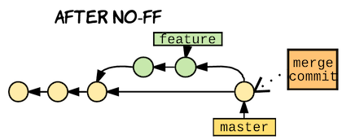

### rerere 处理 merge conflict

> git rerere，用来处理长期存在的 feature branch(某段时间内你在对 codebase 进行 refactor 而其他人同时在进行改动) 或者 rebasing

1. `git merge feature` 遇到 conflict 时
2. `git config rerere.enabled true` 在 project 下开启 rerere
3. `git rerere diff` 展示变化
4. 第一次手动处理 conflict 后，后面的 merge 会自动采取之前的方案，直接修改文件，但不会自动 add 和 commit

## Exercise-5 History and Diffs

### git log

> 场景：查找符合条件的 commit

1. commit message 的 bset practice：简短的一句话描+空白的一行+详细描述
2. `git log --name-status --follow --oneline file-name` 追踪某个文件的变化，包括 add、modified、rename 等操作
3. `git log --grep=i18n --author=nina --since=2.weeks` 查找符合条件的某个 commit，`--since="yesterday"`、`--since="2 weeks ago"`
4. `git log --diff-filter=R --find-renames` 查找有文件被 rename 的 commit
5. `git log --diff-filter=M --oneline` 查找文件被修改的 commit
6. `git reflog` 查看历史 commit，保留 2 周左右，包含 dangling commit

### ^ 和 ~

> 用来引用 commit

---

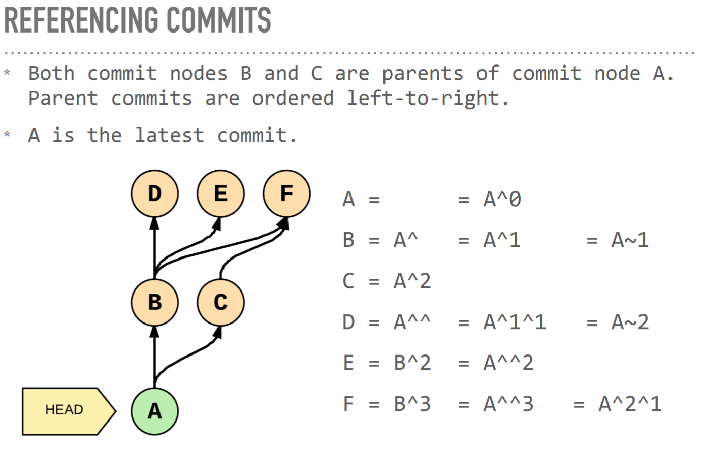

---

### git show

> 场景：显示 commit 信息，更改了什么内容

1. `git show commit --stat --oneline` 查看 commit 信息
2. `git show <commit>:<file>` 查看某次 commit 下某个文件的信息

### git diff

1. `git diff` unstaged changes
2. `git diff --staged` staged changes
3. `git diff A B` 比较两个 branch 的区别

---

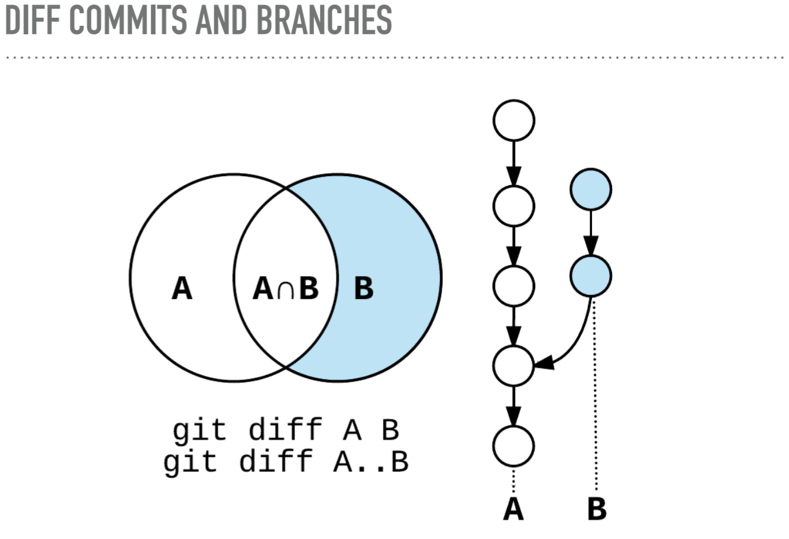

---

### git branch --merge

> 判断 branch 是否已经 merge

1. `git branch --merged master`
2. `git branch --no-merged master`

## Exercise-6 Fixing Mistakes

### git checkout

1. `git checkout -- <file_path>` 用 staging area 的文件内容，覆盖 working area 的内容
2. `git checkout <commit> -- <file_path>` 将 commit 中的该文件，更新到 staging area 和 working area
3. `git checkout <deleting_commit>^ -- <file_path>` 删除了某个文件想要恢复，比`git reset <commit> -- <file_path>`多一步覆盖 working area

---

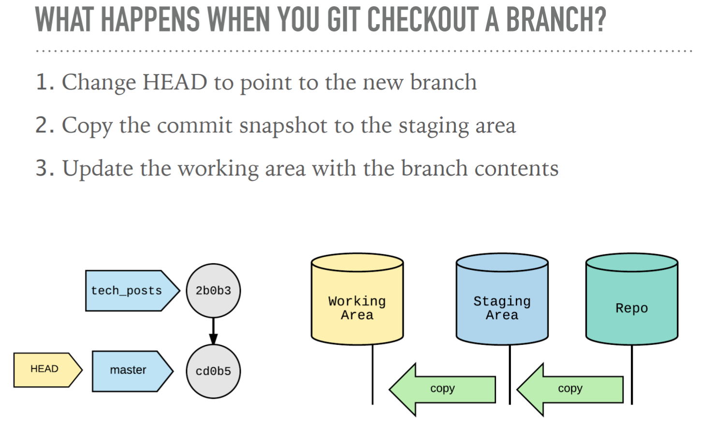

---

> -- flag 用来区分 branch 还是文件

---

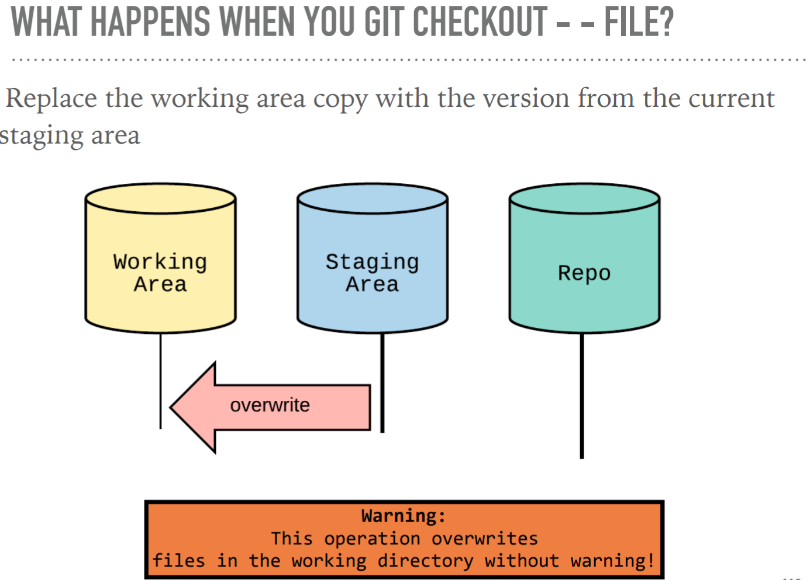

---

> checkout commit -- file 会将这个文件更新到当前 staging area 和 working area

---

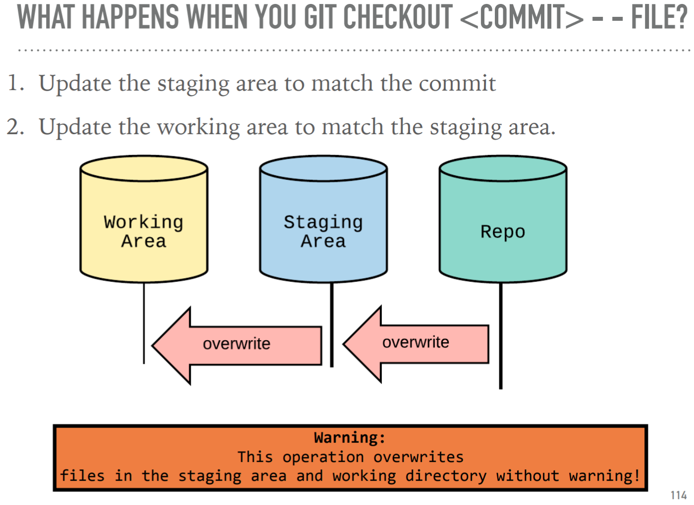

---

### git clean

> 清理 untracked files

1. `git clean -d --dry-run` 确认要 clean 的文件,`-d`包含目录
2. `git clean -d -f` 进行 clean

### git reset

> 永远不要对已经 push 或者 shared 的项目进行 rest，因为 reset 改变了 commit 的历史记录
> 操作 commit，HEAD 和 branch 一起移动，checkout 的区别是 branch 不动，HEAD 移动

1. `git reset --soft <commit>`
2. `git reset <commit>` 默认是`--mixed`
3. `git reset --hard <commit>`

> 操作 file，默认是 mixed 模式

1. `git reset -- <file>` 省略了 HEAD 参数，从 repository 到 staging area
2. `git reset <commit> -- <file>` 从目标 commit 的 repository 到 staging area

---

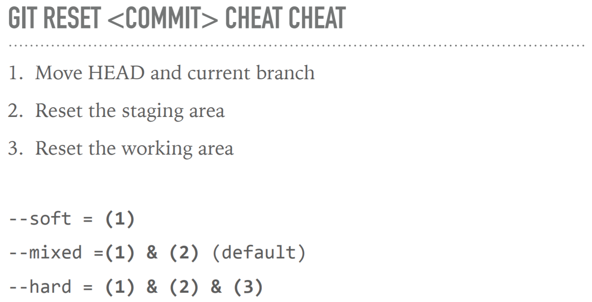

---

> 操作文件

---

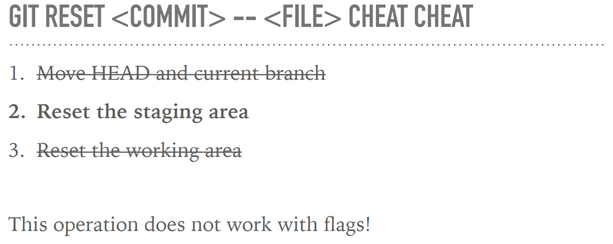

---

> reset 之后，原来那个 commit 其实成了 dangling commit，如何返回： git reset ORIG_HEAD

---

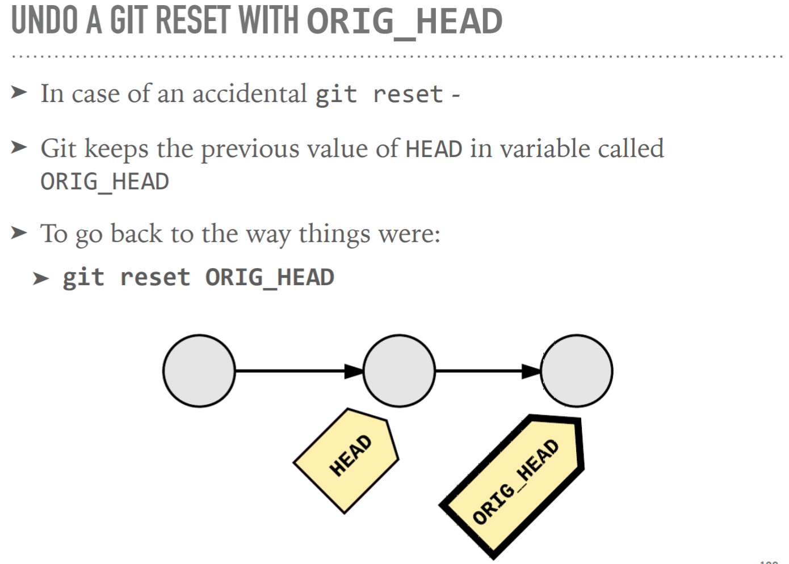

---

> 配合 ORIG_HEAD 撤销 merge 操作

---

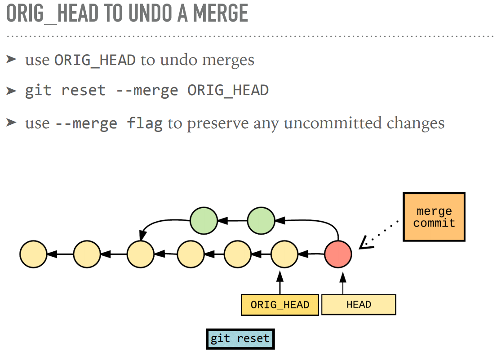

---

### git revert

> revert is SAFE reset
> reset 会改变 commit history，永远不要在 public 项目上 reset 再进行新的 commit
> revert 会新建 commit，用来撤销已经 push 或者说已经 shared 的操作

## Exercise-6 Rebase and Amend

### git commit --amend

> amend 可以修改上一次 commit，但是 SHA1 值仍然会变，其实是创建了一个新的 commit，旧的 commit 变成 dangling commit 被垃圾回收

1. 基于上一次 commit，`git add`添加到 staging area
2. `git commit --amend`

### git rebase

> rebase = give a commit a new parent(a new "base" commit)

> 场景 1：在 feature branch 上干活， master 分支上 fetch 同事的更新，导致了 master 和 feature 分叉（diverged），最好经常将 master 上的更新通过 rebase 合到 feature 上来, 并处理 conflict，这样当 feature branch 最终 merged into master 的时候，尽可能减少 conflict，并且比创建一次 merge commit 更优雅。

1. `git checkout feature` rebase 之前，切换到 feature 分支上
2. `git rebase master` 相当于在 master 上，进行了一次 feature 的 copy commit
3. `git log --oneline` 观察 commit 记录，最新一次 commit 是 feature 的，再早一次 commit 的 master 的

---

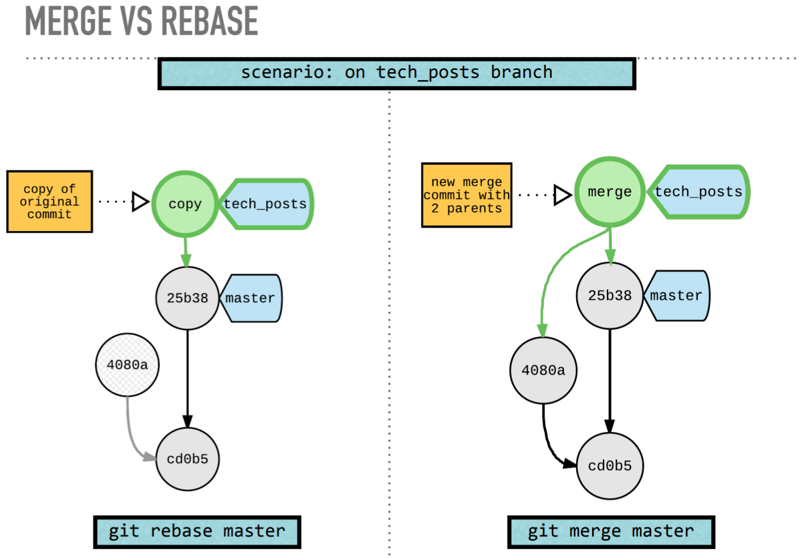

---

> 场景 2：amend 只能修改上一次 commit，rebase 可以修改任意一次

1. `git add new files` 修改想要合并到目标 commit 的内容
2. `git commit --fixup <SHA>` 针对目标 commit 创建一次新的 commit，message 以“fixup！”开头
3. `git rebase -i --autosquash <SHA>^`
4. save and quit

> 场景 3：想把某个 commit 拆分成多个

1. `git rebase -i`
2. 选择 edit
3. `git reset HEAD~`
4. `git add`+`git commit` 多次
5. `git rebase --continue`

> 场景 4：干活阶段应该尽可能 commit 多次，在 push 之前进行本地 rebase 进行合并，提供一次简洁干净的 commit

1. `git rebase -i HEAD~n` n 就是想要操作的前几次 commit

---

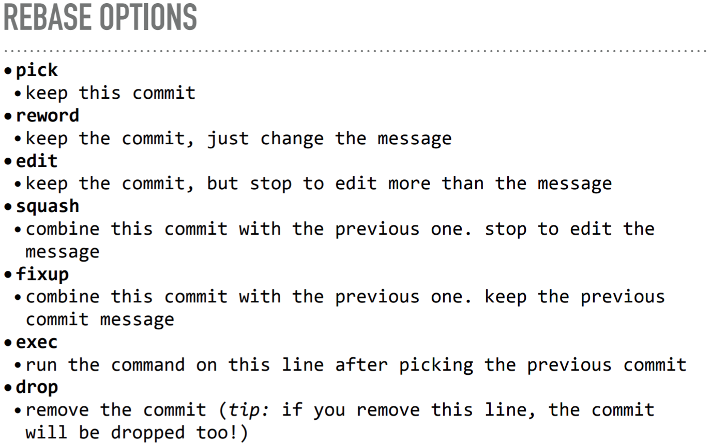

---

### rebase tips

1. `git rebase --abort` 退出 rebase
2. rebase 之前，保险的做法是先 copy 一份当前的 branch`git branch my_branch_backup`，创建但不切换到该分支，如果搞砸了，通过`git reset --hard my_branch_backup`恢复

## Exercise-8 Forks And Remote Repos

### fork & upstream

> 方法 1：

1. 从目标项目 fork 到自己的 Github
2. `git clone` 原作者的版本
3. `git remote -v` 会显示 origin 指向 ORIG_OWNER
4. `git remote rename origin upstream` 将 origin 改成 upstream
5. `git remote add origin git@github.com:MY_FORK/REPO.git` 将 origin 指向自己 fork 的版本
6. `git remote -v` 会显示 origin 指向自己 fork 的版本，upstream 指向 ORIG_OWNER
7. `git branch --set-upstream-to origin/master` master 此时 track 的是 upstream/master

> 方法 2：

1. `git clone` 自己 fork 的版本
2. `git remote add upstream https://github.com/ORIG_OWNER/REPO.git`

### git pull --rebase

> 经常使用 git pull -rebase 更新本地的 fork，这样发起 PR 的时候，commit history 会很干净。

1. upstream 上 master 分支产生了变化
2. `git checkout -b feature` 新建一个 feature 分支然后进行 add、commit 操作
3. `git pull --rebase upstream master`

### tracking branches

1. `git checkout -t origin/feature` 追踪 origin 上的 feature 分支
2. `git push -u origin feature` 第一次 push 的时候告诉 git 需要追踪哪一个分支
3. `git branch -vv` 查看 branch 的远程信息，可以看到落后或领先多少个 commit

### pull & fetch & push & tags

1. `git pull = git fetch && git merge`
2. `git pull --rebase = git fetch && git rebase`
3. `git cherry -v` 可以查看没有 push 到 upstream 的 commit
4. `git push <tagname>` `git push --tags` tag 需要手动 push

---

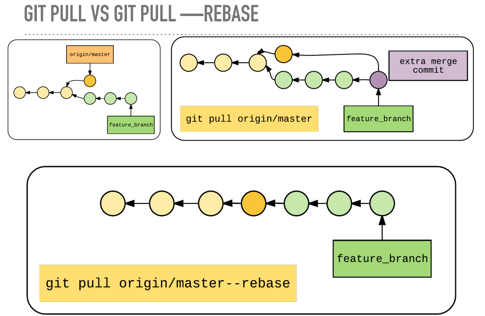

---

### PULL REQUESTS

---

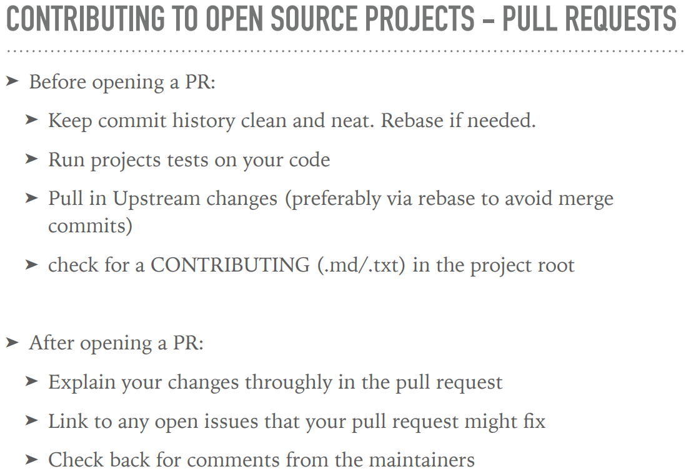

---

### 操作 remote 仓库的一些建议

1. 在提交到 remote 之前，在本地 feature branch 上进行 rebase，再 merge 到 origin（或者 upstream）
2. `git checkout -- <file>`和`git reset --hard`之前，先 stash
3. 接受 PR 时，谨慎 squash、merge、rebase，因为会失去 feature branch 的上下文，将来发生 bug 更难定位
4. 鼓励每个开发使用每个人自己的 fork 版本，这样没有人直接向初始的 codebase 直接提交代码，并且开发自己可以自由 rebase 和 force push

## Exercise-9 Advanced Tools

### git grep

1. `git grep -e <regexp>` 查找文件
2. `git grep -e <expression> -- <file or path` 在文件或路径中查找
3. `git grep --cached -e <regexp>` 在 staging area 中查找
4. `git grep --line-number --heading --break -e <expr>` 优化输出

### git cherry-pick

> git cherry-pick <SHA> 将目标 commit 复制到当前 branch 上

---

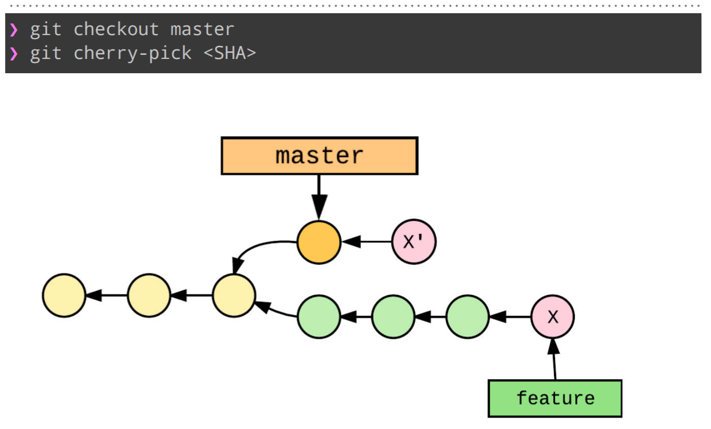

---

### git blame

1. `git blame <filename>` 谁在何时对该文件进行了 commit
2. `git blame -w -M -C`
3. `git log —diff-filter=D --<deleted_file>` + `git blame <commit>^ -- <deleted_file>` 查看被删除的文件
4. `git blame -L1,5 -- <file>` `git blame -L'/^def get/,/^def/' <file>` 查看行数

---

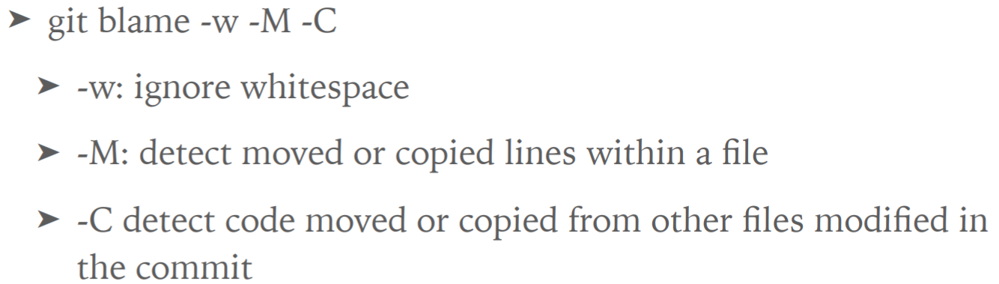

---

### git bisect

> 用来在长期、大量的 commit 中查找出问题的那次 commit

1. `git bisect start <BAD_SHA> <GOOD_SHA>` 在这个范围的 commit 内查找
2. `git bisect bad` `git bisect good` 手动进行测试
3. `git bisect run <command> <arguments>` 配合单元测试或脚本测试

### Git hooks

> .git/hooks 目录，触发钩子时执行的脚本，具体资源参考 slide。Husky 就是 js 社区比较著名的 hooks 工具

### Git template

> git init 时生成的模板，可以自带 giiignore、hooks 等

## Github 技巧，详见 slide

1. 快捷键
2. 显示 commit 的 url 而非 branch 的
3. PR 自动关闭 Issue 的技巧
4. 持续集成 Travis
5. Github restful API, slide 中有一个 react 的例子
6. Hub、Bup 等工具，详见 slide
