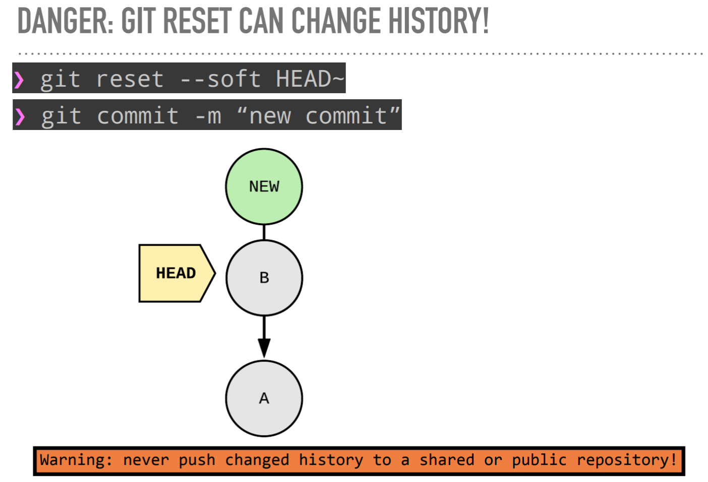

- [Git In-depth](#git-in-depth)
  - [Workshop 地址](#workshop-地址)
  - [Exercises](#exercises)
    - [Exercise-1 Commit、Tree、Blob](#exercise-1-committreeblob)
    - [Exercise-2 Staging and Stashing](#exercise-2-staging-and-stashing)
      - [Staging](#staging)
      - [Stash](#stash)
    - [Exercise-3 References](#exercise-3-references)
      - [Reference](#reference)
      - [Detached HEAD](#detached-head)
    - [Exercise-4 Merging and ReReRe](#exercise-4-merging-and-rerere)
      - [Fast-Forward](#fast-forward)
      - [git merge --no-ff](#git-merge---no-ff)
      - [处理 merge conflict](#处理-merge-conflict)
    - [Exercise-5 History and Diffs](#exercise-5-history-and-diffs)
      - [git log](#git-log)
      - [^ ~](#-)
      - [git show](#git-show)
      - [git diff](#git-diff)
      - [git branch](#git-branch)
    - [Exercise-6 Fixing Mistakes](#exercise-6-fixing-mistakes)
      - [git checkout](#git-checkout)
      - [git clean](#git-clean)
      - [git reset](#git-reset)
      - [git revert](#git-revert)
  - [Tips](#tips)

# Git In-depth

## Workshop 地址

https://github.com/nnja/advanced-git

## Exercises

### Exercise-1 Commit、Tree、Blob

1. 初始化一个最简单仓库，新建一个 hello.txt
2. 用`git cat-file -t/-p`命令，观察 commit、tree、blob 之间的关系，通过 SHA1 生成的 id 来关联
3. 用`cat`命令观察 ` .git/HEAD` 指向了`.git/refs/heads/master` ，而 master 中是 commit id

### Exercise-2 Staging and Stashing

#### Staging

1. 理解 Working Area、Staging Area、Repository 的区别
2. `git ls-files -s`命令查看 Staging Area 的文件，不会展示 working area 的变化
3. 习惯使用`git add -p`命令，可以用来跳过一些不想要 staging area 的改动
4. add 到 staging area 之后想要反悔，用`git reset file`撤回到 working area，但保留了文件的改动，想要撤销改动再用`git checkout file`命令

#### Stash

> stash 的典型场景是，dev 分支正在开发新功能，master 出现了需要紧急修复的 bug，此时无法切换到 master 分支，因为文件有冲突，要么 commit，要么 stash，要么 reset 或者 checkout 文件的变化。
> 最佳实践是，`git stash save "message" --include-untracked`未完成的工作，然后切换到 master 分支，新建一个 bugfix 分支，修复 bug 并 merge 到 master 分支后删除 bugfix 分支，然后切换到 dev 分支`stash pop`

1. stash 对于 working area 和 staging area 的变化都有效，但是想要 stash 新增的 untracked 的文件，需要使用`git stash --include-untracked`
2. `git stash save "message"`描述未完成的工作
3. `git stash branch <optional branch name>`创建一个新的分支
4. `git checkout <stash name> -- <file-name>`从 stash 中恢复单个文件，而不是 apply 整个 stash
5. 清空 stash 可以用 pop、drop、clear（清空所有）

### Exercise-3 References

#### Reference

> tag、branch、HEAD 都是 reference，都指向 commit，HEAD 默认指向 branch，branch 会随着 commit 操作自动更新到最新的 commit 上，而 tag 不会移动，是 snapshot。annotated tag 比普通 tag 更加常用。

1. `git show-ref`命令查看所有的 references，`--heads | grep heads-name`，`--tags | grep tag-name`
2. `git tag <tag-name>`不带参数的命令打上 lightweight tag，指向了某次 commit
3. `git tag -a <tag-name> -m <message>`带参数的命令打上 annotated tag，指向了某次 commit 但储存了格外的信息因此 SHA1 值会变
4. `git tag --points-at <commit-id>`来查看某个 commit 上所有的 tag
5. `git show <tag-name>`查看某个 tag 的信息，千万不要打成`git tag show`，这样是打一个叫 show 的 tag
6. `git tag -d <tag-name>`来删除 tag

#### Detached HEAD

> 永远不要手动 git checkout 到某个 commit-id ，HEAD 会直接指向这个 commit ，形成 detached HEAD。如果在此基础上进行了一次 commit，就创建了 dangling commit，HEAD 移到到最新的 commit，没有任何 branch 或者 tag 指向这个 commit。要么被垃圾回收，要么为这个 dangling commit 手动创建新的分支。

1. `git log --oneline`命令可以看到这个 dangling commit，以及 HEAD 指向了它
2. `git checkout <branch-name>`会提示当前的 commit 没有任何 branch 指向它
3. `git branch <new-branch-name> <commit-id>`来 connect 这个 dangling commit

### Exercise-4 Merging and ReReRe

#### Fast-Forward

> 创建 feature 分支后，如果 master 分支没有进行任何 commit，此时将 feature 分支 merge 到 master 分支上，相当于直接把 master 分支指向了 feature 分支指向的 commit。缺点是会形成线性的 commit，无法追踪 feature 分支，不利于定位 bug。

#### git merge --no-ff

> 保留 merge 历史，即便 master 没有任何 commit，merge 的时候强行创建一次 commit

#### 处理 merge conflict

> git rerere，用来处理长期存在的 feature branch(某段时间内你在对 codebase 进行 refactor 而其他人同时在进行改动) 或者 rebasing

1. 在两个分支后各做一次 commit，制造 conflict
2. `git config rerere.enabled true`，在 project 下开启 rerere
3. `git rerere diff`展示变化
4. 第一次手动处理 conflict 后，后面的 merge 会自动采取之前的方案，直接修改文件，但不会自动 add 和 commit

### Exercise-5 History and Diffs

#### git log

> 场景：查找符合条件的 commit

1. commit message 的 bset practice：简短的一句话描+空白的一行+详细描述
2. `git log --name-status --follow --oneline file-name`，追踪某个文件的变化，包括 add、modified、rename 等操作
3. `git log --grep=i18n --author=nina --since=2.weeks`，查找符合条件的某个 commit，`--since="yesterday"`、`--since="2 weeks ago"`
4. `git log --diff-filter=R --find-renames`，查找有文件被 rename 的 commit
5. `git log --diff-filter=M --oneline`，查找文件被修改的 commit

#### ^ ~

> 用来引用 commit

#### git show

> 场景：显示 commit 信息，更改了什么内容

1. `git show commit --stat --oneline`，查看 commit 信息
2. `git show <commit>:<file>`，查看某次 commit 下某个文件的信息

#### git diff

1. `git diff`：unstaged changes
2. `git diff --staged`：staged changes
3. `git diff A B`，比较两个 branch 的区别

#### git branch

> 判断 branch 是否已经 merge

1. `git branch --merged master`
2. `git branch --no-merged master`

### Exercise-6 Fixing Mistakes

#### git checkout

> -- flag 用来区分 branch 还是文件

1. `git checkout -- <file_path>`，用 staging area 的文件内容，覆盖 working area 的内容
2. `git checkout <commit> -- <file_path>`，更新 staging area 匹配 commit，更新 working area 匹配 staging area
3. `git checkout <deleting_commit>^ -- <file_path>`，删除了某个文件想要恢复

#### git clean

> 清理 untracked files

1. `git clean -d --dry-run`，确认要 clean 的文件,`-d`包含目录
2. `git clean -d -f`，进行 clean

#### git reset

> 操作 commit，HEAD 和 branch 一起移动，checkout 的区别是 branch 不动，HEAD 移动

> 操作文件

> reset 之后，原来那个 commit 其实成了 dangling commit，如何返回： git reset ORIG_HEAD

#### git revert

> revert is SAFE reset
> reset 会改变 commit history，永远不要在 public 项目上 reset 再进行新的 commit
> revert 会新建 commit，用来撤销已经 push 或者说已经 shared 的操作

## Tips

1. `git checkout -`返回上一个 branch
